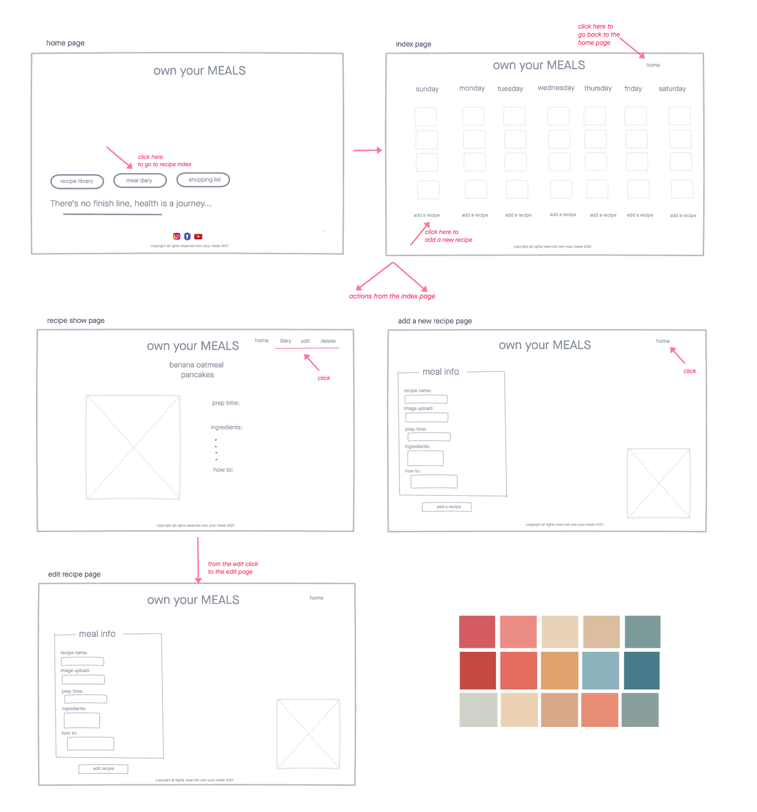
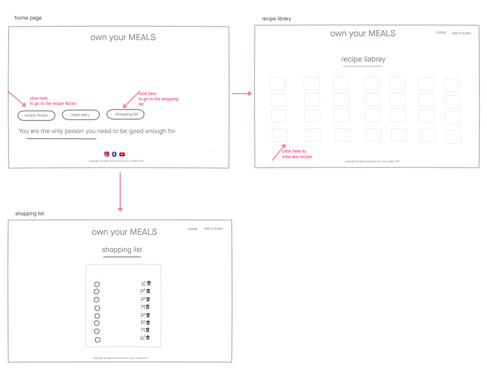
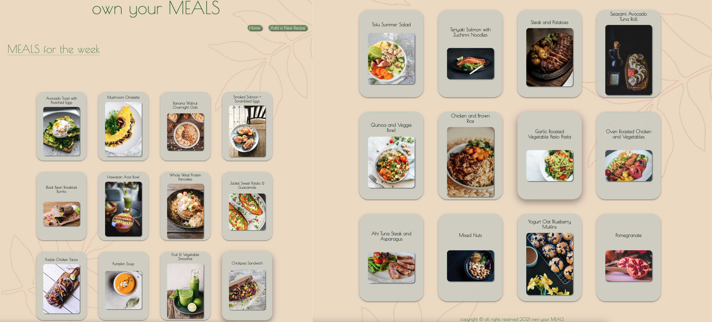
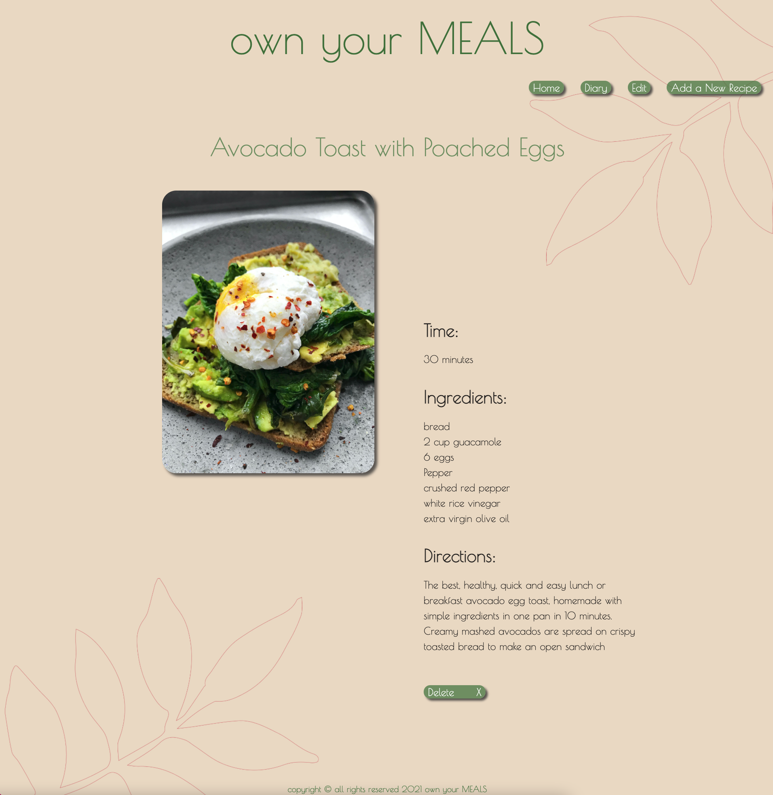
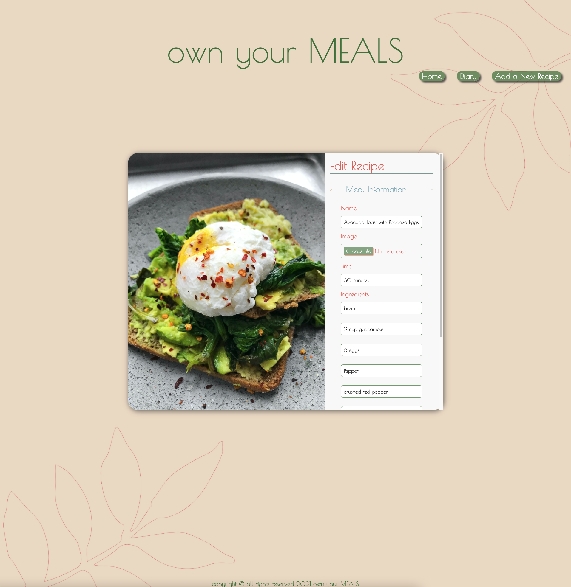
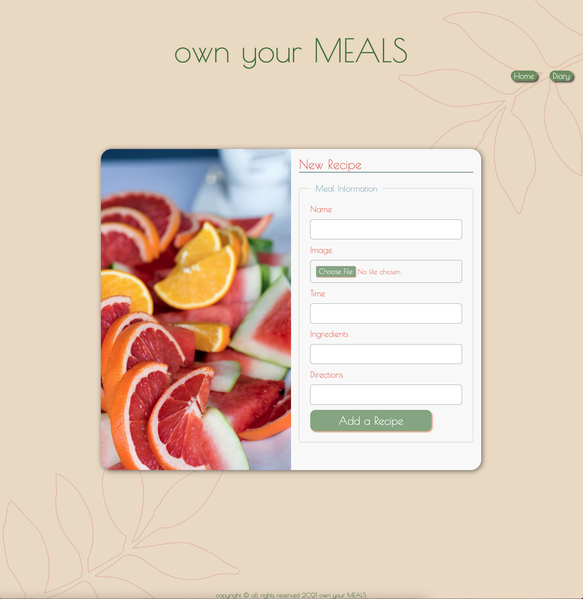

# own your MEALS

A full stack application that allows you to add recipes to your meal diary. After competing as a bodybuilder and being on a very strict diet for nearly five years, I wanted a way to maintain the structure and discipine of a healthy meal plan while keeping meals interesting.

## Technologies Used

* HTML5
* CSS3
* JavaScript
* Nodejs
* Express
* MongoDB
* Mongoose
* [Materialzie](https://materializecss.com/)
* [Icons](https://fontawesome.com/icons?d=gallery&p=2)
* [Figma](https://www.figma.com/files/user/979381893432674988?fuid=979381893432674988)
* [Pinterest](https://www.pinterest.com/)
* [Instagram](https://www.instagram.com/weglow/)
* [Unsplash](https://unsplash.com/)
* [Pexels](https://www.pexels.com/)
* [Imgur](https://imgur.com/)
* [Invisionapp](https://www.invisionapp.com/inside-design/design-resources/do/)
* [Google Fonts](https://fonts.google.com/)

## User Stories
* As a user, I want to be able to have access to a plethora of meals that are healthy yet exciting
* As a user, I want to be able to plan out my meals in a weekly diary
* As a user, I want to be able to add and update the meals in diary so I can plan ahead and stock up 

## Screenshots
### Wireframe

### Working App 

## Getting Started

* [Click here]() to see the deployed app!

## Future Enhancements
* The ability for the user to be able to login and logout
* The ability for the user to add a recipe from the library to a specific day of the week in the diary.
* The ability for the user to create a shopping list for a grocery shop